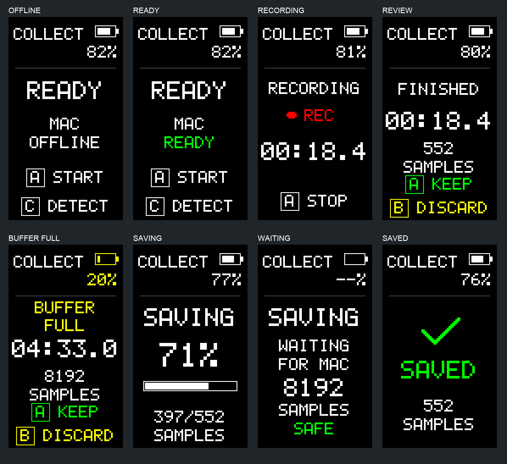
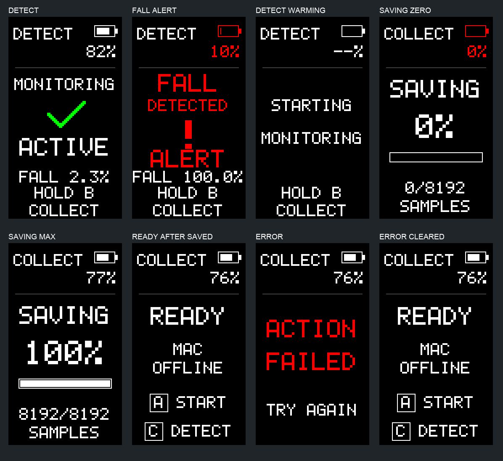

# M5StickC PLUS2 UI and battery display

Based on remote `main` at `5def1a6d8968b87e3cf67bbaf4cc5c1620c3ba7e`.
This change affects presentation and battery measurement only.

## Screens

The shared black status area shows DETECT/COLLECT, a battery icon and a size-2
percentage. The narrow 135-pixel display needs two rows here: the mode and icon
share the first row; the percentage sits beneath the icon. No essential text
uses size 1. All layouts are checked against the actual 6×8 scaled font cells.

- DETECT: MONITORING, a green check and ACTIVE; fall probability is secondary.
  An above-threshold result shows red FALL DETECTED, an exclamation icon and
  ALERT. Inference milliseconds are removed from the screen. The original
  threshold, buzzer, cooldown and inference behavior are unchanged; no visual
  alert is latched beyond the detector's current result.
- READY: calm MAC READY, MAC OFFLINE or CONNECTING status, A START and C DETECT.
  Long connection phrases wrap across readable lines rather than shrink.
- RECORDING: size-3 timer, red REC indicator and A STOP. No link status or sample
  count is shown; recording remains local-first. The dot is steady to avoid
  adding animation or extra redraw work.
- REVIEW / BUFFER FULL: duration, sample count, green A KEEP and yellow B
  DISCARD. Full-buffer handling and retention are unchanged.
- SAVING: size-4 percentage, progress bar and acknowledged/total sample count.
  No button actions are displayed.
- WAITING FOR MAC: SAVING, WAITING / FOR MAC, count and SAMPLES SAFE. These are
  retained RAM samples, not flash storage: power loss or reboot still loses
  pending samples, exactly as before.
- COMPLETE: check and SAVED confirmation for 1.8 seconds, then the normal
  READY layout. The backend remains `RecordState::Complete`; existing A START
  and C DETECT semantics continue unchanged.
- A newly observed command error shows ACTION FAILED temporarily, then restores
  the current view after 1.8 seconds. A sticky error flag cannot cover it forever.

These previews are enlarged host framebuffers, not photos of installed firmware.
The renderer clears the body only on a screen transition. Fixed-size text caches
redraw changed opaque glyphs, and the progress bar updates only when its value
changes. There is no display-loop heap allocation. Battery refresh does not wake
or draw a sleeping screen. The original 60-second idle screen sleep, wake-only
first press, debounce, A/B/C actions and guarded pairing reset are unchanged.

## Exact board battery measurement

Sources:

- [Official PLUS2 board documentation and schematic](https://docs.m5stack.com/en/core/StickC-Plus2)
- [Official M5Unified power implementation, pinned to 44d0c52dca65b5bf8e49fd75dde833ee800754f4](https://github.com/m5stack/M5Unified/blob/44d0c52dca65b5bf8e49fd75dde833ee800754f4/src/utility/Power_Class.inl)

The PLUS2 has no AXP192. Its official `board_M5StickCPlus2` definition selects
GPIO38 / ADC1 channel 2 and a ×2 voltage-divider ratio. The existing firmware is
ESP-IDF, so a small board-specific module uses the same measurement method
without introducing Arduino/M5Unified initialization or changing GPIO power,
buttons, display, I2C, Wi-Fi or BLE setup.

The module uses ESP-IDF ADC oneshot, 12-bit width and 12 dB attenuation. ESP32
line-fitting calibration uses the board's factory eFuse Vref/two-point data;
no guessed reference voltage or raw-count conversion is used. Eight calibrated
readings are averaged and multiplied by two once every three seconds. A separate
priority-1 task on core 0 supplies a cached atomic percentage. The unmodified
priority-8 IMU task remains on core 1. Rendering never initiates an ADC read.
Initialization/task failure is nonfatal; a failed read or absent factory
calibration produces `--%`. The first ADC duration is logged; reads over 5 ms
are reported for physical timing verification.

The official `pmic_adc` percentage estimate is used: `(mV - 3300) * 100 /
(4150 - 3350)`, safely bounded to 0–100 (0 at/below 3300 mV, 100 at/above
4100 mV). This is M5Unified's approximate voltage-based estimate, not a linear
physical state-of-charge claim or a calibrated fuel gauge. Discharge load,
charging and cell condition can affect it. No charging state is inferred.
Normal indication is white, at/below 20% yellow, and at/below 10% red.

## Verification

Before editing, the existing smoke suite and a full latest-main firmware build
passed. Baseline image size was 1,444,144 bytes. After editing:

- `./M5BLECollector/tools/smoke-tests.sh`: seven Python guards, sanitized C++
  recording-buffer/wire tests, native UI/battery tests, and Swift journal/protocol
  tests passed.
- New native tests check voltage mapping and clamping, zero/failing readings,
  Complete→SAVED→READY timing, expiring error presentation, unchanged collector
  status, sample duration and progress math, text bounds and pairwise overlap,
  and real ST7789 commands reconstructed into 135×240 frames. Unchanged screens
  send no SPI transactions; a normal timer tick sends one changed glyph.
- New hash guards pin IMU reads/scheduling, mode persistence, buttons, wake/sleep
  and command dispatch to the base commit; BLE/buffer/OTA and all Mac source/test
  files match the untouched baseline.
- Existing preservation verification passed with both the original detector
  checkout and the final binary. The exact locked 147,976-byte model is embedded
  once; its SHA-256 remains
  `1553dde844bf34928d360cc5f23e06f353e1c78e7aac6b2271cbc36410920530`.
- Partitions, normalization, threshold, detector functions, inference kernels,
  replay vectors and configuration are unchanged. Swift release build passed.
- Final application: 1,462,384 bytes, within the unchanged 3,997,696-byte OTA slot.
  SHA-256: `59a1067c37f40437f32464771b86ddb8487a6322c01d91e6f65bb63011da9836`.
- Generated SDK retains NimBLE encrypted bonding, persisted bonds, disabled host
  flow control, PSRAM and rollback. ADC eFuse calibration is enabled. No new
  UI/battery warnings were introduced; existing third-party warnings match the
  baseline.

Optional preview reproduction (no device access): compile
`tests/ui_battery_test.cc` using C++17 and `-I tests/display_stubs`, then give the
executable an output-directory argument. It writes the actual driver frames as
135×240 PPM files. The smoke suite runs the same checks without writing images.

## Hardware checks still required

No USB-connected M5 was available, so this change has not been installed or
physically verified. No flash, partition table, NVS, bond or device data was
modified. Before installing, finish or explicitly discard any pending recording.
Use the existing application-only OTA update workflow; retain the detector
fallback slot, bootloader, partition table and OTA rollback behavior.

On the actual board, verify calibrated voltage/percentage and ADC read duration,
readability in both modes, alert appearance, A/B/C and wake-only interactions,
SAVED→READY timing, review/keep/discard, reconnect transfer, and a sustained
collection with approximately 30 Hz and no new timing-gap flags. Runtime timing
and battery accuracy cannot be established by host tests. Also verify the
normal startup model self-test and OTA health confirmation after installation.

## Changed files

- `M5BLECollector/README.md`
- `M5BLECollector/UI_BATTERY.md`
- `M5BLECollector/VALIDATION.md`
- `M5BLECollector/docs/ui-collect-preview.png`
- `M5BLECollector/docs/ui-detect-preview.png`
- `M5BLECollector/firmware/main/CMakeLists.txt`
- `M5BLECollector/firmware/main/battery_level.h`
- `M5BLECollector/firmware/main/battery_monitor.cc`
- `M5BLECollector/firmware/main/battery_monitor.h`
- `M5BLECollector/firmware/main/device_ui.h`
- `M5BLECollector/firmware/main/main.cc`
- `M5BLECollector/firmware/main/simple_display.h`
- `M5BLECollector/firmware/main/ui_presentation.h`
- `M5BLECollector/tests/display_stubs/driver/gpio.h`
- `M5BLECollector/tests/display_stubs/driver/spi_master.h`
- `M5BLECollector/tests/display_stubs/freertos/FreeRTOS.h`
- `M5BLECollector/tests/display_stubs/freertos/task.h`
- `M5BLECollector/tests/test_ui_guards.py`
- `M5BLECollector/tests/ui_battery_test.cc`
- `M5BLECollector/tests/ui_preservation_baseline.json`
- `M5BLECollector/tools/smoke-tests.sh`
